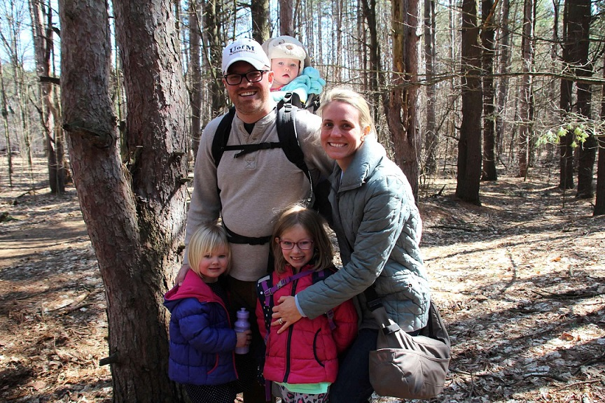

```{r setup, include=FALSE}
options(htmltools.dir.version = FALSE)
```
class: center, bottom
background-image: url(http://www.tbdsolutions.com/wp-content/themes/tbdsolutions/images/logo.png)

[bit.ly/tbd_mbc](http://bit.ly/tbd_mbc)
---

class: center, middle

# The Why

.pull-left[

]

.pull-right[

]

???

---
class: center, middle
background-image: url(https://images-na.ssl-images-amazon.com/images/I/413ZHN3409L.jpg)
background-size: 150px
background-position: 8% 90%

> ### "...only 18% of psychiatrists and 11% of psychologists in the United States routinely administer symptom rating scales to patients to monitor improvement. This is equivalent to treating hypertension without using a blood pressure cuff" 

.pull-right[
[Kennedy Forum](https://www.thekennedyforum.org/news/measurement-based-care-issue-brief), *Fixing Behavioral Health Care in America*, 2015
]

???

- National work on screening, assessment, and outcome tools
- We have enough tools. We don’t need more — we need effective implementation

---
class: inverse, center, middle

> ### "For a successful technology, reality must take precedence over public relations, for Nature cannot be fooled." 

.pull-right[
[Richard Feynman](https://science.ksc.nasa.gov/shuttle/missions/51-l/docs/rogers-commission/Appendix-F.txt), 1986
]

???

- Feynman's quote is from the Roger's Commission report after the Challenger disaster
- Substitute "treatment", "funding strategy", etc. in place of "technology"
- We must always remember that we are doing this work not because of a new fad, or a compliance requirement, or because data is hip now, etc. but because we are seeking to rescue people from a ravaging force of nature
- Data is only worthwhile inasmuch as it allows us to model truth.

---
class: inverse, center, middle
background-image: url(https://upload.wikimedia.org/wikipedia/commons/d/d4/Wikidata_Map_April_2016_Huge.png)

# ᗑ
# Where are we going?

???

- The field traditionally relies on narrative psychosocial assessments 
- Ever unhelpful GAF
- These aren’t actionable at an individual or systemic level
- Tools bring objectivity and measurability to a sometimes subjective industry
- New tools (and the creative use of existing tools) allow for a more nuanced and complex understanding of individuals
- Summarizing person to a single number (e.g. the GAF) is clearly reductive
- What about 250k measures per day? A [recent study using wearables](http://journals.plos.org/plosbiology/article?id=10.1371/journal.pbio.2001402) did just that
- We are already capturing data, and are likely to use it if we have it, so we must be purposeful about how we measure individuals
- Treat our knowledge like a portfolio
- A comprehensive portfolio has many types of data, and today we'll focus on one which providers are uniquely situated to collect and act upon.

---
class: inverse, center, middle
background-image: url(https://upload.wikimedia.org/wikipedia/commons/d/d4/Wikidata_Map_April_2016_Huge.png)

# ✋
# Where are we ~~going~~ now?

???

Minimal use of structured measures integrated at patient, program and system level.
- Poor penetration of tool use
- Lack of consistency in gold standard tools

**How many of you have clinicians currently using cross-cutting measures from DSM5, or other brief symptom or functional instruments?**

**How many of you are engaged in at least one value-based payment arrangement?**

Some current glimmers of what's coming: 
- metrics endorsed by NQF using PHQ-9 are currently only outcomes measures for behavioral health used nationally (e.g. CCBHC)
- now [implemented in HEDIS 2017](http://www.ncqa.org/hedis-quality-measurement/hedis-learning-collaborative/hedis-depression-measures)
- Functional measures noted as key gap in standard metrics (cf. [NQF Person- and Family-Centered Care Measures](http://www.qualityforum.org/ProjectMeasures.aspx?projectID=73867) )

---
class: center, middle

### *Survey says...*

```{r, echo=FALSE, message=FALSE, warning=FALSE, out.width='100%', fig.height=6}
library(readxl); library(tidyr); library(dplyr); library(forcats)
library(plotly)

survey <-
  read_excel("national_tools_survey_2016.xlsx",
             sheet = 2, skip = 2) 

# Remove homegrown
survey <- survey[1:50,-1]
survey <- survey[,-10]
survey <- survey[,-15]
survey <- survey[,-25]
survey <- survey[,-32]

survey <-
survey %>%
  group_by(STATE) %>%
  gather(tool,used, LOCUS:`ADI-R`) %>%
  mutate(used = used == "X") %>%
  ungroup()

by_tool <-
  survey %>%
  mutate(
    tool = gsub("[[:space:]]", "", tool)
  ) %>%
  group_by(tool) %>%
  summarize(n = sum(used, na.rm = T)) %>%
  filter(n > 0) %>%
  ungroup() %>%
  droplevels() 

by_tool %>%
  plot_ly(
    x = ~fct_reorder(tool, n, .desc = T), 
    y = ~n) %>% 
  add_bars() %>% 
  layout(margin = list(b = 150),
         xaxis = list(title = "", tickangle = 45),
         yaxis = list(title = "Number of states", range = c(0, 50)))

```

???

- Data exists.  Not standard nationally, but there is potential at the state level
- Check out report [here](http://www.tbdsolutions.com/wp-content/uploads/2016/09/Behavioral-Health-Screening-Assessment-and-Outcomes-Tools.pdf)
- [Data source](http://www.tbdsolutions.com/wp-content/uploads/2016/09/Michigan-and-National-Screening-Assessment-and-Outcomes-Tools-2016-09-1-1.xlsx)

---
class: inverse, center, middle

# Real World Uses
### ~~*instead of* people~~
### *by* people

???

"To know and not to do is not to know" - Stephen Covey
We must use data, not just look at it, e.g. Look at FitBit but not exercise more

- 2 typical responses, from the same people: "We're not doing cookie cutter treatment" & "Can't it just tell me what I need to do?!"

This is still a human process:
- Natural clinical concern that this would be (a) reductive of individual complexity (b) a replacement of their clinical skills
- Looking at actual process—from the point of assessment into pre-planning, tx plan, goals and objectives, authorizations, revisiting auths and need for services

---
class: inverse, left, middle
background-image: url(https://static.pexels.com/photos/72552/pexels-photo-72552.jpeg)
background-size: contain

# ☤
# With patients


???

- Washington study: For patients with depression, the median response to treatment reduced from ~64 weeks pre- to 25 weeks post-implementation. *Unutzer J, et al. 2012*
- How long does it take? ~20 minutes during initial visit,  ~5 minutes during follow-up visits
- Can focus on items endorsed by the person and their supports as important
- Consider how closely these are aligned with scope, intensity, duration
- Could use relevant areas to prompt consideration of potential referrals to PT, nursing, OT, etc.
- Note that the individual view varies from person to person (cf. CAFAS paths)

---
class: inverse, center, middle
background-image: url(http://www.publicdomainpictures.net/pictures/10000/velka/step-background-112876782627O8h.jpg)
background-size: contain

# ☉➝☉➝☉➝☉➝☉➝☉
## Use data at each contact to:

### *monitor response to treatment* 
### *guide focus of session*
### *prompt treatment changes*

???

Treat-to-Target Approach (University of Washington)

["requires a change in the treatment plan every 10-12 weeks if the patient has not had at least a 50% improvement in symptoms using a validated measure."](https://aims.uw.edu/resource-library/measurement-based-treatment-target)

[Used extensively in treating](https://www.ncbi.nlm.nih.gov/pubmed/clinical?term=%22treat%20to%20target%22):
- diabetes
- hypertension
- arthritis

Also applied to depression and other mental illnesses.

---
class: center, middle

### *e.g. connecting to Person-Centered Planning*

```{r eval=require('DT'), echo=FALSE, message=FALSE, warning=FALSE, out.height=8 }

library(dplyr); library(DT); library(RColorBrewer)

DT_in <- read.csv("df.csv")
DT_in <- DT_in %>% select(-X)

DT_in %>%
  datatable(rownames = F,
            colnames = c('Area','Need','Score','Type of Support','Frequency',
                         'Daily Support Time','Important To/For'),
            fillContainer = FALSE, 
            extensions = 'Scroller',
            options = list(dom = 't',
                   deferRender = F,
                   scrollY = 200,
                   scroller = TRUE)) %>%
  formatStyle('score', color = styleInterval(c(6), c("#800026","#ffffcc")),
              backgroundColor = styleInterval(c(1:8), brewer.pal(9,"YlOrRd")))

```


---
class: inverse, center, middle
background-image: url(https://static.pexels.com/photos/37009/pexels-photo.jpg)
background-size: contain

# ⌨
# In programs...

???

What competitive advantage would this data provide for you relative to competitors?
- Think of the value of your data as a product.  
- How much is it worth now?  
- How much could it be worth?

How do we use this data to assess 
- which activities add value
- the type of training needed
- what types of new programs needed
- justify service provision decisions
- keep services at the appropriate scope, time, and duration. 


---
class: center, middle

### *e.g. mapping locations*
```{r, echo=FALSE, message=FALSE, warning=FALSE, out.width='100%', fig.height=6, eval=require('leaflet')}
library(leaflet); library(dplyr)

lat <- rnorm(700, mean = 43.2, sd = 1)
lon <- rnorm(700, mean = -84.5, sd = 0.4)
geocoded <- data.frame(lat,lon) 

leaflet() %>%
  fitBounds(
    lng1 = -86,  
    lat1 = 44,
    lng2 = -85,
    lat2 = 42
  ) %>%
  addProviderTiles("CartoDB.Positron") %>%
  addMarkers(
    data = geocoded,
    lat = ~lat, 
    lng = ~lon,
    clusterOptions = markerClusterOptions()
  )

```

???

Primary concerns:
- Differentiate services from competitors
- Work smart: Operate more efficiently (more quality per dollar)


- What if we could identify the geographic areas where people with a certain set of needs were clustered, so that we could build services to be more easily accessible to the people who need them?
- Could be applied to purchasing office sites; defining caseloads for mobile workers

---
class: right, middle
background-image: url(https://c1.staticflickr.com/8/7194/6927050552_f43f586ef9_b.jpg)
background-size: 500px
background-position: 0% 100%

# ◵ 
# Across a system

???

State/National Level Primary concerns:
- Reward quality performance
- Improve outcomes for the population
- Benchmarking, inter-agency comparisons

---
class: center, middle

### *e.g. clustering*

???

- Hop out of presentation [to application](https://tbdsolutions.shinyapps.io/exploreSIS_node_mshn/)
- Go to "Patterns of Need" in left bar and view clusters

---
class: inverse, center, middle

# ↝
# How to get from
# here to there

???

What do we mean by "there"?

Here are some overheard conversations from an imaginary behavioral health provider:

“Your symptoms seem to have been inching up over our last 3 assessments. This is a pivotal point in time to make changes in your life, based on what we’ve seen from other clients in the past.  Making changes at this point has helped people avoid harm to their family life and relapses with substance abuse.”

“Based on your child’s CAFAS scores, as we’ve been getting to know her over the past 3 months, this is our recommended course of treatment. 86% people with similar needs have had positive outcomes from this course of treatment.”

“We ask you to complete the PHQ-9 because we value how you feel about your treatment, and how you are responding.”

“Based on your assessment, here is a menu of the most relevant services related to your needs. People with similar needs usually chose this service and that service.”

---
class: inverse
background-image: url(https://blogs.vmware.com/cloudops/files/2016/06/gap.jpg)

# ⚠ 1. Mind the gaps

???

Gap Analysis to determine what’s missing:

**Cover all conditions / life areas** Does the available data reflect the impact of services on all areas of life which are the target of services?  All areas which inform services?  This assumes that people in a given system/organization have a similar conception of what life areas affect the people and the work they are doing.  While all models are abstractions, there are a number of well-thought out models relevant to behavioral health.  E.g. ...

- [WHO's International Classification of Functioning](http://www.who.int/classifications/icf/en/), which you can browse [here](http://apps.who.int/classifications/icfbrowser/)
- [NIMH's Research Domain Criteria](https://www.nimh.nih.gov/research-priorities/rdoc/constructs/rdoc-matrix.shtml)

**For each population served** To tackle a treat-to-target approach, that thoroughly uses quantitative assessment process with a common thread throughout, there have to be adequate tools for all of the things you’re seeing people for

**Screening and assessment** Not just a tool, but gaps between a screening tool and an assessment tool. Not enough to say “we have an assessment that measures everything we treat people for”—it’s possible that some assessment are really long, and you only use them once they’ve been in for a month, subsequently missing the screening section. 

**Used in clinical practice** Do you have assessments that result in structured data, covering each population you serve and appropriate for each point of contact?  Define expectations around minimum frequency for administration

**Entered in EMR** 

**Data is used to inform practice**

---
background-image: url(https://upload.wikimedia.org/wikipedia/commons/2/28/Hobach_Canyon_steel_arch_bridge._Idaho_-_NARA_-_283681.jpg)
background-size: contain

# ᚄ 2. Bridge the gaps

???

Select tools to fill the gaps... *example tools*
- [DSM5 Cross-Cutting Symptom Measures](https://www.psychiatry.org/psychiatrists/practice/dsm/educational-resources/assessment-measures)
- [Kennedy Forum supplement](http://thekennedyforum-dot-org.s3.amazonaws.com/documents/MBC_supplement.pdf)
- [PROMIS measures](http://www.healthmeasures.net/explore-measurement-systems/promis)
- Approaches: One tool to rule them all, short suite

1. Pay providers to use the tool
2. Ensure the tool can be completed quickly enough to avoid patient burnout.
3. Create an efficient workflow for the tool.
4. Integrate data form the tools into the EHR as a routine part of clinical practice.

---
class: inverse
background-image: url(http://simplexmotion.com/wp-content/uploads/2015/06/Network-Abstract-Wallpaper.jpg)

# ◇ 3. Connect the diamonds

???

- Note: Diamonds indicate a decision point in process maps

*Two critical processes:*
- **Operational processes** (e.g. data collection, EMR workflow, communication, etc.)
- **Clinical decision-making** (e.g. algorithms)

- Define how tools are used as specific points around the care process?  e.g. Integrate into assessment/treatment planning/authorization/review process

---
background-image: url(https://static1.squarespace.com/static/55f45174e4b0fb5d95b07f39/55f45537e4b09d46d484695d/55f45566e4b09d46d485afd6/1361664651243/1000w/118414-116396.jpg)
background-position: 50% 100%

# ⚛ 4. Get to know

???

- At the individual level, this means getting feedback from clinicians and patients
- At the program and system level, it means investing in analytics
- Build analytics capacity
- Sharing methods / reproducibility
- Prototyping approach; stay curious
- The "unreasonable effectiveness of data" to answer questions

---
background-image: url(http://www.publicdomainpictures.net/pictures/80000/velka/old-bicycle-on-a-wooden-floor.jpg)
background-size: contain
background-position: 50% 100%

# ☛ 5. Get to work

???

While clinicians, program managers, etc. have been working throughout this process, this is when to start **implementing in decision making**

**Knowledge Mobilization Steps**
- *Identify Measurement Owners*  Identify responsibility for performance on measures in portfolio
-	*Identify Levers for Action*   Identify key actions for improving performance across the portfolio
-	*Process for Decision Quality*  Implement processes for improved decision quality using data.  Based on research into organizational decision-making.
-	*Map Flow of Information*  Map flow of information through committees/departments to clarify patterns of communication and action.
-	*Initiate PDSA Cycle* 
-	*Expert Analysis*  Where required.
- *Assess Sustainability*

---
class: center, bottom
background-image: url(http://www.tbdsolutions.com/wp-content/themes/tbdsolutions/images/logo.png)

[tbdsolutions.com](www.tbdsolutions.com)
